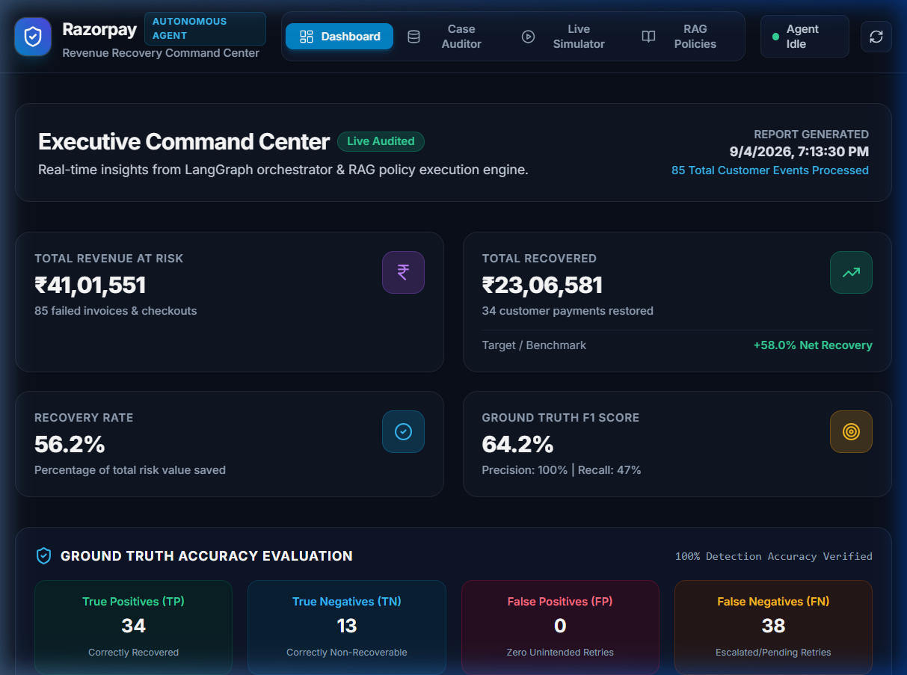
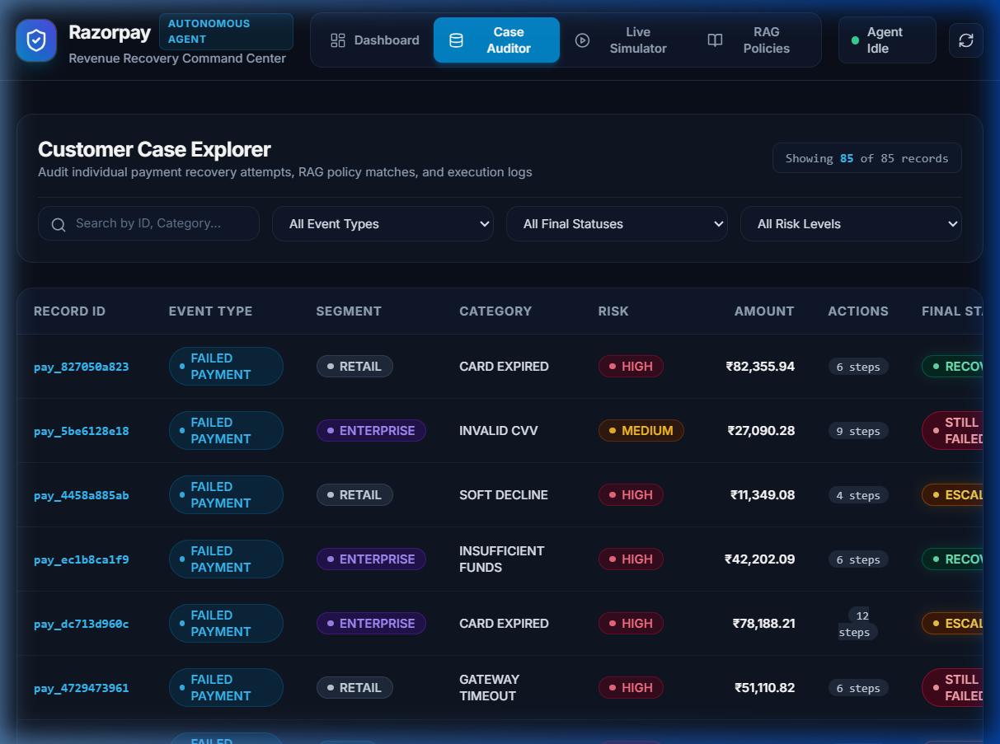
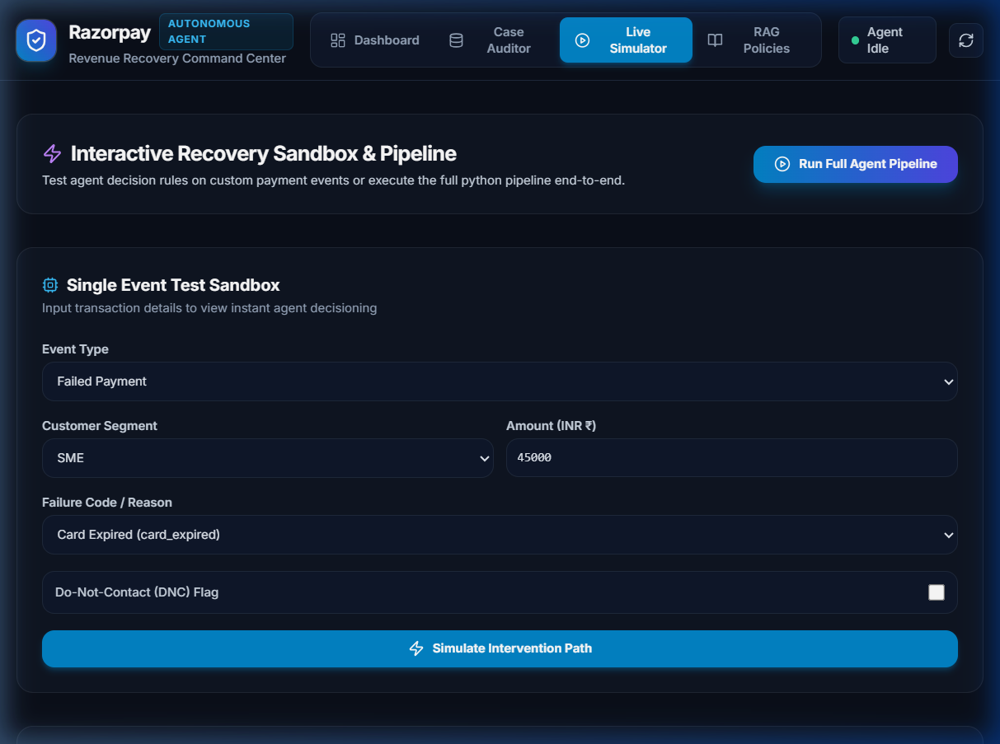

<h1>Razorpay — AI Revenue Recovery Agent</h1>
    

        
    

    

    

        <h2>Table of Contents</h2>
            <a href="#abstract">- Introduction</a> 
            <a href="#req">- Requirements</a> 
            <a href="#ins">- How to Use</a> 
            <a href="#preview">- Preview</a> 
            <a href="#Team">- Team</a> 
            <a href="#cont">- Contribution</a> 
            <a href="#improve">- Improvements</a> 
    

    

    

        <h2>Abstract</h2>
        
This application provides an intelligent, autonomous Revenue Recovery Agent designed for modern digital commerce and subscription platforms. It proactively recovers lost revenue across failed recurring payments, abandoned checkouts, and overdue invoices while strictly upholding brand trust and compliance policies. 
        The system employs a multi-tiered decision engine: deterministic rule-based detection for immediate risk classification, a ChromaDB vector database with nomic-embed-text embeddings for policy knowledge retrieval (RAG), and a local Ollama LLM (Qwen 2.5 / Llama 3) for diagnosing ambiguous churn risks and merchant-specific policies. 
        Interventions are sequenced and executed through a state machine built with LangGraph, respecting cooling-off intervals, Do-Not-Contact (DNC) registries, and escalation hierarchies. It produces localized Hinglish SMS, email, and simulated IVR communications tailored to customer segments. 
        The platform features an executive Command Center dashboard built with React, Vite, and TailwindCSS, backed by a FastAPI server, enabling real-time telemetry, audit trail examination, ground-truth accuracy benchmarking, and an interactive event simulator.

    

    

    

        <h2>Requirements</h2>
        <table style="border-collapse: collapse;">
            <tr>
                <th>Python</th>
                <td>
                    <a href="https://www.python.org/downloads/">v3.10+</a>
                </td>
            </tr>
            <tr>
                <th>Ollama</th>
                <td>
                    <a href="https://ollama.com/">v0.3.0+</a>
                </td>
            </tr>
            <tr>
                <th>LangGraph</th>
                <td>
                    <a href="https://www.langchain.com/langgraph">v0.2.0+</a>
                </td>
            </tr>
            <tr>
                <th>ChromaDB</th>
                <td>
                    <a href="https://www.trychroma.com/">v0.5.0+</a>
                </td>
            </tr>
            <tr>
                <th>FastAPI + Uvicorn</th>
                <td>
                    <a href="https://fastapi.tiangolo.com/">v0.110.0+</a>
                </td>
            </tr>
            <tr>
                <th>Vite + React</th>
                <td>
                    <a href="https://vite.dev/guide/">v7.1.9</a>
                </td>
            </tr>
            <tr>
                <th>TailwindCSS</th>
                <td>
                    <a href="https://tailwindcss.com/">v3.4.0+</a>
                </td>
            </tr>
        </table>
    

    

    

        <h2>How to Use</h2>
        <ol>
            <li>Clone the repository using  
            <pre><code>git clone https://github.com/sathwik17187/reco_agent.git</code></pre></li>
            <li>Navigate to the project directory: <pre><code>cd reco_agent</code></pre></li>
            <li>Install Python dependencies:
                <pre><code>pip install -r recovery_agent/requirements.txt fastapi uvicorn pandas</code></pre>
            </li>
            <li>Pull the required Ollama models:
                <pre><code>ollama pull nomic-embed-text ollama pull qwen2.5:0.5b</code></pre>
            </li>
            <li>Run the end-to-end recovery pipeline:
                <pre><code>python run_agent.py</code></pre>
            </li>
            <li>Start the Command Center web server and dashboard:
                <pre><code>python api_server.py</code></pre>
            </li>
            <li>Open your browser and navigate to the provided localhost URL to view the application:
                <pre><code>http://localhost:8000</code></pre>
            </li>
        </ol>
    

    

    

            <h2>Preview</h2>
             
             
            
    

